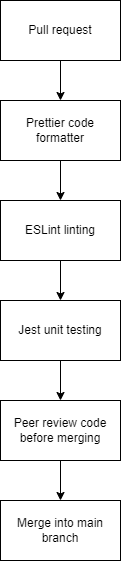

# CI/CD Platform Phase 1

In this current version of the pipeline, our team wishes to maintain certain standards of the code that is pushed or pulled by our fellow team members.
We have a commit hook that runs when any team member attempts to commit, as well as a github action that runs on all pushes/pull requests
All packages are installed as dev dependencies, and will not bloat the final product.

These include:

1. Formatter
2. Linter
3. Testing
4. Human Verification of Code

 ## Format

 Our team decided to use the Prettier formatting tool because it is a de facto industry standard formatting tool for javascript projects. It is available as an npm package, and most ides provide a way to integrate with it to autoformat code while editing. 
 We implemented this in our pipeline itself by running a format-check to make sure everyone's code is formatted in the same way to maintain readibility and ease of use. This check will run whenever a team member pulls or pushes a piece of code in order for everyone to have the same type of code whenever they use it.
 In addition to checking on the github action, we also added prettier with the write option to a commit hook using the husky and lintstaged npm packages in case someone doesn't have ide integration.

 ## Linter

 Our team wanted to make sure that the code we create is correct, maintainable, and free of code smells. We use eslint to flag potential issues in the code. Eslint is another de facto industry standard tool, and helps flag potential errors or undesireable patterns in javascript. It runs as a github action to ensure compliance as well as on a git hook for a quicker feedback loop

 ## Testing

 Our team wanted to make sure that any new feature did not break the software and could safely integrate with it rather than break it. Thus we added another key functionality to the pipeline
 which is the testing job which runs all of the E2E testing for the product whenever it is pushed or pulled. To ensure that all existing code works as supposed to and that any new code added to it also works with
 without adding any new bugs to it. This job would also run all of the unit tests present in the application. We will be using Jest to run all of these tests.

 ## Human Verification of Code

 Whenever any team member wishes to merge a piece of code into the master branch, a key part of the pipeline is the peer review of the code. In order for the code to be merged into the product, it must be checked and given 
 the seal of approval by another team member before it can be merged. This is to ensure that another person has checked the code and that the team is okay with this code being merged into the master branch after passing 
 all of the necessary tests. 

 We have implemented all of these features into our CI/CD pipeline. 

 Here is a diagram that shows how we implemented the above features in the pipeline. 

 

 ## Future Considerations 

 In the future, we wish to integrate an automated code quality tool like Codacy that can check the quality of our code and functions and reduce the workload on our team members for checking and verifying the code via Pull Requests and Peer Reviews. 
 We would also want to implement a documentation generation feature in our pipeline in order to reduce the work needed to document everything that we have decided and built into our software.
 
