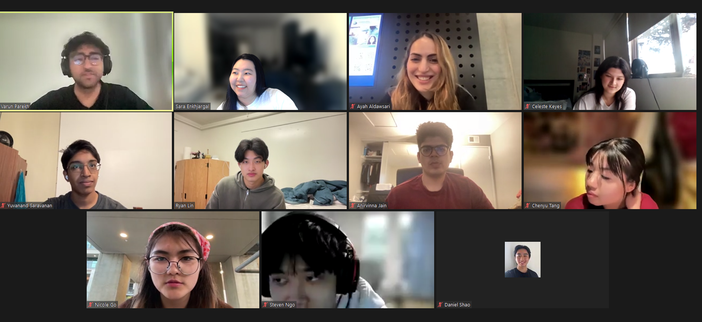

# Sprint 1 Review Meeting Minutes
## Type: Warmup Exercise Review
**Attendance**: 
- Chenyu Tang
- Steven Ngo
- Ryan Lin
- Daniel Shao
- Sara Enkhjargal
- Anirvinna Jain
- Nicole Go
- Yuvanand Saravanan
- Celeste Keyes
- Varun Parekh
- Ayah Aldawsari

**Time and Place:**
Sunday 4/28 7:00 PM on Zoom

## Agenda:
### Opening
- Greetings and explain the purpose and the expected outcomes of today's meeting
### Presentation Session
- Each participant presents their contributions to Warmup Exercise.
- Screen capturing for each presentation.
### Documentation Session
- Members to take detailed notes during presentations in a shared document.
### Discussion
- Open discussion on the presentations.

## Notes from the Meeting:
Anirvanna Jain: Miro Board. Contributed to design ideas, HTML, and CSS. Participated in SWOT analysis, and the video presentation.   

Sara Enkhjargal: Set up GitHub Project, GitHub Ruleset. Contributed to HTML and JavaScript. Participated in SWOT analysis, and the video presentation. Helped finalize the GIFs used in the widget for the Happy and Very Happy buttons. Code reviewed for pull requests and merged to the main branch.  

Ayah Aldawsri: Started the HTML code base we need for the Sentiment Rating Widget, and was a part of the HTML group. Helped to find images for the buttons for the HTML file as well. Ideas for when we click a button an image would appear.    

Celeste Keyes: Was a part of the CSS team with Chenyu, Nicole, and Varun, helped choose sounds and colors for our buttons and wrote additional comments while peer reviewing. Participated in the SWOT analysis. Wrote the meeting notes for our last meeting on the sprint.  

Chenyu Tang: Started the CSS code template based on the HTML code, with a few details added about hover, active and focus. Provided the idea about gif and sound when clicking the emotion button. Peer-reviewed with Varun, Celeste and Nichole about the CSS part over several meetings. Wrote comments for CSS code.  

Daniel Shao: Peer program with Ryan on creating JavaScript template to display GIF and sound when button is clicked  

Nicole Go: Worked on the CSS team to add color (and choose colors) to the buttons and have a hover color (when the cursor goes over the button), I also met with my group in a timely manner and discussed what changes needed to be made to the HTML team for the HTML and CSS code to work together. Participated in SWOT analysis. Created a meeting for virtual SWOT analysis.   

Ryan Lin: Peer program with Daniel on creating JavaScript template to display GIF and sound when button is clicked. Set up code formatter (prettier), including git hooks, github actions, and vscode settings. Helped groupmates install.  

Steven Ngo: Part of the HTML team, provided ideas for HTML format of sentiment rating widget, provided GIFs for JavaScript portion of widget  

Varun Parekh: Peer reviewed, discussed and programmed the CSS portion of the site with Nicole, Chenyu and Celeste through several meetings. Helped finalize the audio used in the widget for the Neutral, Happy and Very Happy buttons. Participated in the SWOT analysis of the site and contributed several points to it. Reviewed Sara’s pull request, wrote comments and merged it into the main branch. Checked to make sure all branches were merged and deleted after use.  

Yuvanand Saravanan: Created a plan for the sentiment widget on a Miro board with Anirvinna. Joined the first HTML meeting to give suggestions on how to structure the HTML elements and implement features such as images and audio. Provided some audios and GIFs to be included in the widget.  

## Items for Future Investigation:
- Retrospective Meeting for Warmup Exercise

**Meeting finished at 7:30pm**
