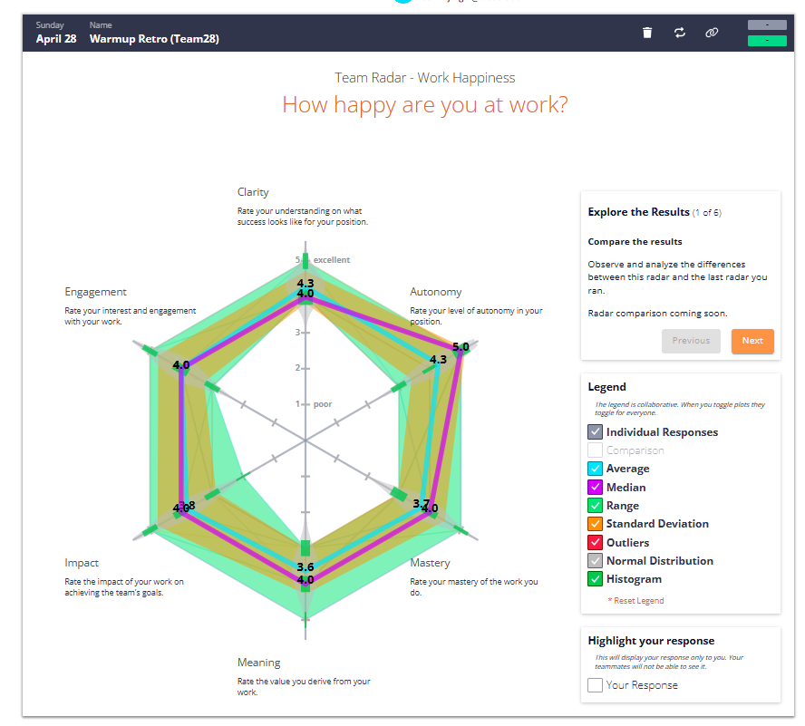
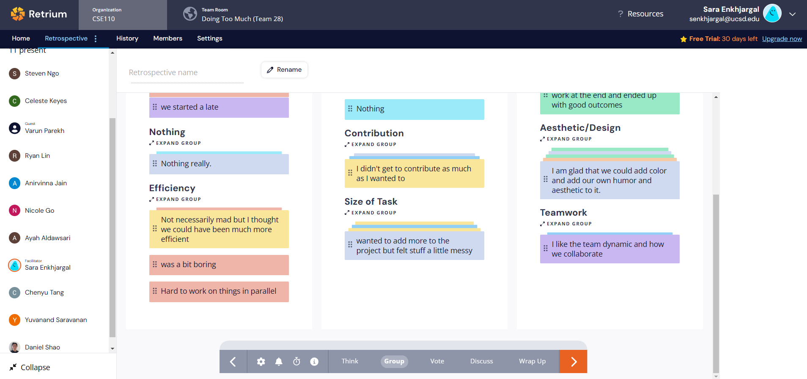
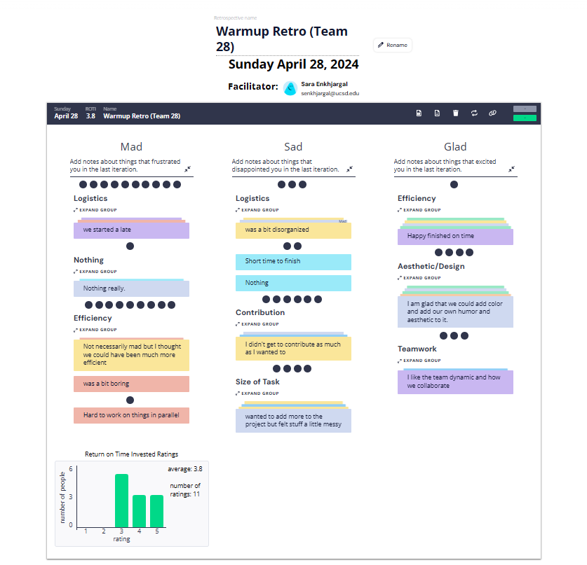

# Retrospective Meeting Minutes
## Type: Warmup Exercise Retrospective
**Attendance**: 
- Chenyu Tang
- Steven Ngo
- Ryan Lin
- Daniel Shao
- Sara Enkhjargal
- Anirvinna Jain
- Nicole Go
- Yuvanand Saravanan
- Celeste Keyes
- Varun Parekh
- Ayah Aldawsari

**Time and Place:**
Sunday 4/28 7:30 PM on Zoom

## Agenda:
### Opening
- Brief overview of Retrium and how it will be used in today's meeting.
  
### Retrium Exercises
1. Team Radar: Work Happiness

2. Mad Sad Glad Retrospective

### Discussion and feedback
- Team dynamic and collabration are very good.  
- Short time to finish the warmup exercise.
- Subgroup based on HTML, CSS and JavaScript is not appropriate for group project.
  
## Items for Future Investigation:
- Group project ideas

## Decisions Made:
1. Create User Stories for the Project
- Develop user stories to outline the needs and goals of the end users.
2. Create Tasks for Each User Story
- Break down each user story into specific tasks to clarify the steps needed for completion.
3. Form Subgroups and Assign Tasks with Due Dates
- Organize team members into subgroups, assign tasks to these groups, and set due dates for task completion.
4. Start Project Early
- Initiate the project earlier to provide enough time for thorough planning, execution, and review. This will allow for better management of the workload and improve the overall quality of the project outcomes.

**Meeting finished at 8:00pm**
