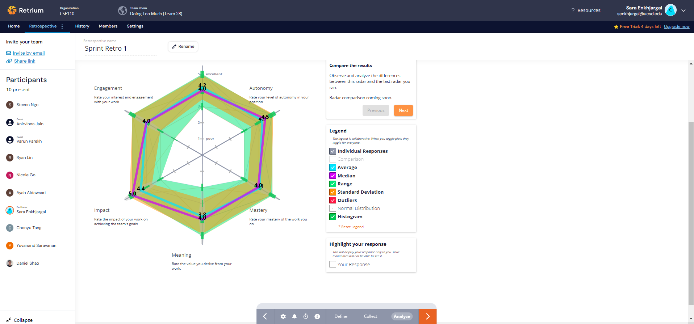
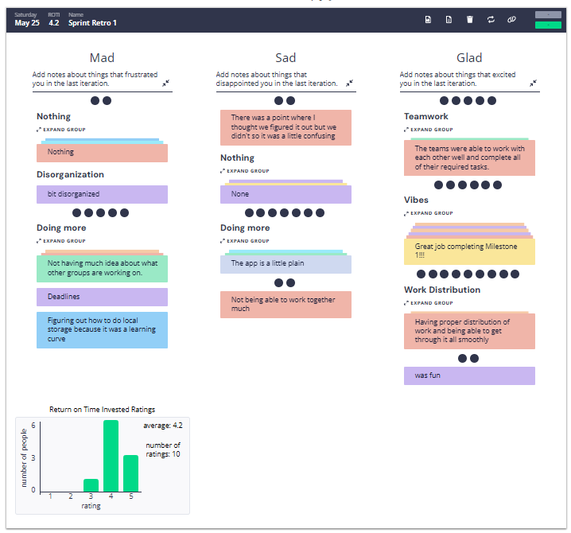

# Retrospective Meeting Minutes
## Type: Final Project Milestone 1 
**Attendance**: 
- Chenyu Tang
- Steven Ngo
- Ryan Lin
- Daniel Shao
- Sara Enkhjargal
- Anirvinna Jain
- Nicole Go
- Yuvanand Saravanan
- Varun Parekh
- Ayah Aldawsari

**Time and Place:**
Saturday 5/25 2:30 PM on Zoom

## Agenda:
### Opening
- Brief overview of Retrium and how it will be used in today's meeting.
  
### Retrium Exercises
1. Team Radar: Work Happiness

2. Mad Sad Glad Retrospective

### Discussion and feedback
- Teams were able to work with each other well and complete all of their required tasks. 
- Some of the team members wanted to do more for milestone 1
- App is a little plain
  
## Items for Future Investigation:
- Improving the design of the app

## Decisions Made:
1. Improving the design of the app
2. Adding TA's suggestions as a new User Story
3. Changing User Sotry 1-2 and 1-3 to new User Story

**Meeting finished at 3:00pm**
