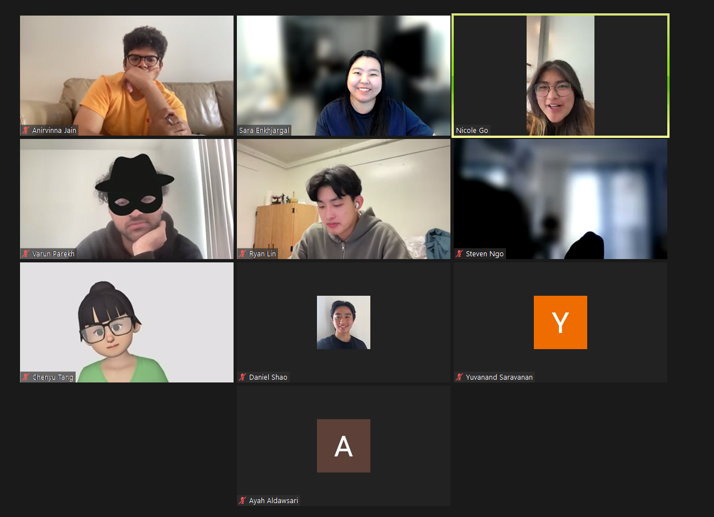

# Sprint 1 Review Meeting Minutes
## Type: Final Project Milestone 1
**Attendance**: 
- Chenyu Tang
- Steven Ngo
- Ryan Lin
- Daniel Shao
- Sara Enkhjargal
- Anirvinna Jain
- Nicole Go
- Yuvanand Saravanan
- Varun Parekh
- Ayah Aldawsari

**Time and Place:**
Saturday 5/25 2:00 PM on Zoom

## Agenda:
### Opening
- Greetings and explain the purpose and the expected outcomes of today's meeting
### Presentation Session
- Each participant presents their contributions to Final Project Milestone 1.
- Screen capturing for each presentation.
### Documentation Session
- Members to take detailed notes during presentations in a shared document.
### Discussion
- Open discussion on the presentations.

## Notes from the Meeting:

Varun: Worked on User Story 2 with Nicole, Celeste and Chenyu. Worked on the front end for the task feature for Milestone 1. Documented via video and markdown the CI/CD pipeline for the project.

Chenyu: Worked on User Story 2 with Nicole, Varun, and Celeste. Did the back end part of the journal and task feature with Nicole.

Ayah: Worked on User story 3 with group 3, my part was to make the buttons for journal and task lists switch to show either the tasks box or the journal box as well as making the title changes. 

Daniel: Worked on User Story 1 with Ryan, Steven, and Sara. Did E2E test for User Story 1.

Ryan: Worked on User Story 1 with Daniel, Steven, and Sara. Set up CI/CD pipeline, added localstorage functionality to app.

Nicole: Worked on User Story 2 with Celeste, Varun, and Chenyu. Did the back end part for local storage (for both the journal and task component) with Chenyu. Worked on ADR entries with Yuva and Daniel. 

Yuvanand: Worked on User Story 3 with Sara, Anirvinna, and Ayah. Wrote HTML code for the view tasks and view journals buttons.

Steven: Worked on User Story 1 with Ryan, Daniel, and Sara. Worked on a function for the calendar's today list. Created CI/CD phase 1 build pipeline diagram

Anirvinna: Worked on User Story 3 with Sara, Yuvanand, and Ayah. Was responsible for R&D, Unit testing the code, and also the creating any required videos.  

Sara: Worked on User Story 1 with Ryan, Daniel and Steven. Did the base code and calendar part. Worked on User Story 3 with Ayah, Yuvanand, and Anirvinna. Did the E2E tests for User Story 3. Created slides and recorded videos with Anirvinna.

Celeste: Worked on User Story 2 with Nicole, Varun, and Chenyu. Did the front end part of the journal feature. 

## Items for Future Investigation:
- Retrospective Meeting for Final Project Milestone 1

**Meeting finished at 2:30pm**
