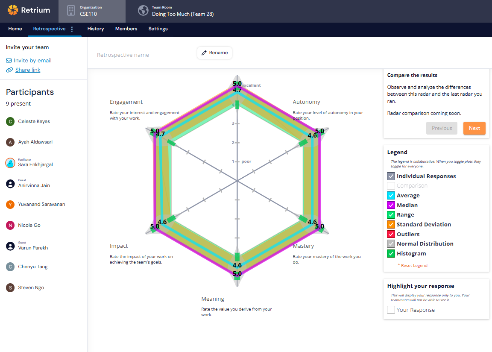

# Retrospective Meeting Minutes
## Type: Final Project Milestone 2 
**Attendance**: 
- Chenyu Tang
- Steven Ngo
- Ryan Lin
- Daniel Shao
- Sara Enkhjargal
- Anirvinna Jain
- Nicole Go
- Yuvanand Saravanan
- Varun Parekh
- Ayah Aldawsari
- Celeste Keyes

**Time and Place:**
Thursday 6/6 8:00 PM on Zoom

## Agenda:
### Opening
- Brief overview of Retrium and how it will be used in today's meeting.
  
### Retrium Exercises
Team Radar: Work Happiness  

### Discussion and feedback
- Teams were able to work with each other well and complete all of their required tasks. 

  
## Items for Future Investigation:
- Making the final videos

## Decisions Made:
1. Each member record a 30 seconds video for private final video
2. Each member upload a photo for public final video

**Meeting finished at 8:30pm**