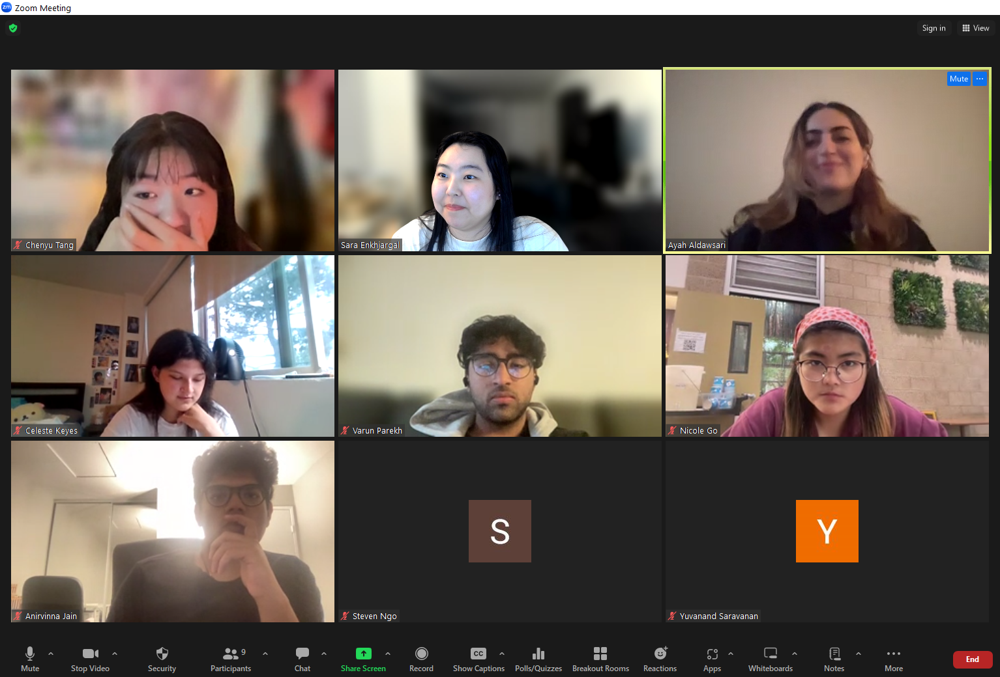

# Sprint 2 Review Meeting Minutes
## Type: Final Project Milestone 2
**Attendance**: 
- Chenyu Tang
- Steven Ngo
- Ryan Lin
- Daniel Shao
- Sara Enkhjargal
- Anirvinna Jain
- Nicole Go
- Yuvanand Saravanan
- Varun Parekh
- Ayah Aldawsari
- Celeste Keyes

**Time and Place:**
Thursday 6/6 7:00 PM on Zoom

## Agenda:
### Opening
- Greetings and explain the purpose and the expected outcomes of today's meeting
### Presentation Session
- Each participant presents their contributions to Final Project Milestone 2.
- Screen capturing for each presentation.
### Documentation Session
- Members to take detailed notes during presentations in a shared document.
### Discussion
- Open discussion on the presentations.

## Notes from the Meeting:

Ryan: Set up jsdoc in CI/CD pipeline, debugged unit tests/e2etests, added functionality/tests for search bar, general organization of code (splitting into different functions, files, etc), resolve conflicts on GitHub. Currently working on setting up code coverage.

Celeste: Worked on user story 4 with Varun, Chenyu, Nicole, and Anirvinna. Adjusted the save button on the journal and task feature so that it would return to the home page once pressed.

Yuvanand: Worked on user story 6 with Sara, Ayah, and Anirwin. Wrote javascript code to save user mood selection to local storage and made each day’s mood only modifiable on its corresponding day.

Varun: Worked on user story 4 with Chenyu, Nicole, Celeste, and Anirvinna. Created the documentation for all the CSS styling done on it. Fixed a bug that changed the positioning of the task and journal buttons when opening the task and journal pages respectively. Wrote the documentation for all the Javascript functions to be able to be viewed via JSDocs and documented all of the test files.   

Nicole: Worked on user story 4 with Varun, Chenyu, Celeste, and Anirvinna. Improved the UI by making the title text input box and entry/details input box of equal length for both the journal and task portions. 

Chenyu: Worked on user story 4 with Varun, Celeste, Nicole, and Anirvinna. Adjusted the journal and task window by centering them, having x changed to be the exit button with a red color, and highlighting the active button when either journal or task is clicked, added a hover effect for the main window for a few buttons, added space between viewing tasks and journals, and some tiny details to make the whole UI more balanced. 

Ayah: Worked on user story 6 with Sara, Yuvanand, and Anirvinna, and worked on adding the mood tracker emojis. Added the emojis in the HTML file, then designed them and styled them in CSS, and then added their functionality where only the emoji chosen gets highlighted and the rest do not, as well as they only appear in the journal and not in the tasks view. 

Steven: Worked on user story 5 with Sara, Ryan, and Daniel. Wrote javascript code for a functional search bar that searches for journals

Daniel: Worked on user story 5 with Sara, Ryan, and Steven. Added and verified E2E testing, and code review, merged the E2E branch to the main branch of the project.

Anirvinna: Worked on user story 4, which required changing the UI, and also added E2E tests for new features. Worked on user story 6, added E2E tests and Unit Tests. 

Sara: Organized User Story 4, 5, 6's planning meetings. Added delete confirmation window feature for task and journal based on TA's suggestion. Developed front end of search bar. Debuged for mood tracker backend. Resolving conflicts before merging user stories into the main branch ensures a stable and cohesive codebase. 

## Items for Future Investigation:
- Retrospective Meeting for Final Project Milestone 2

**Meeting finished at 8:00pm**